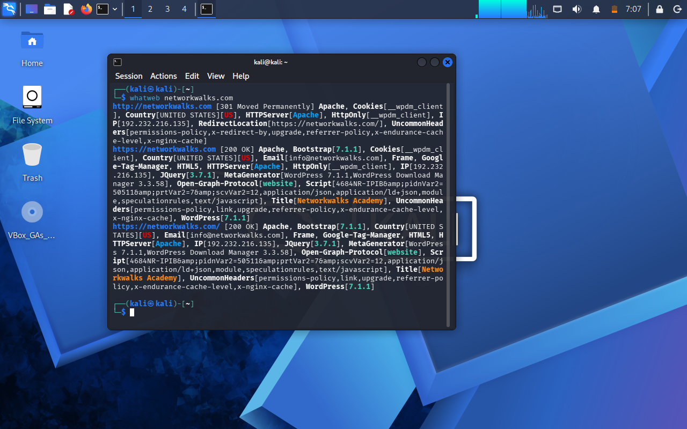
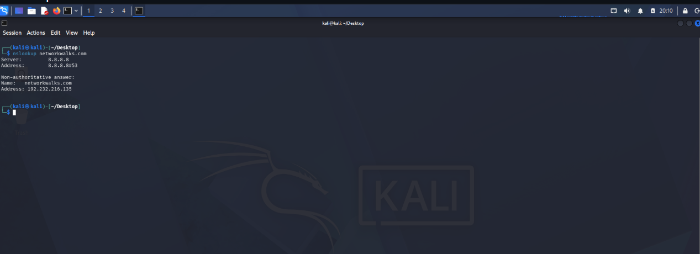
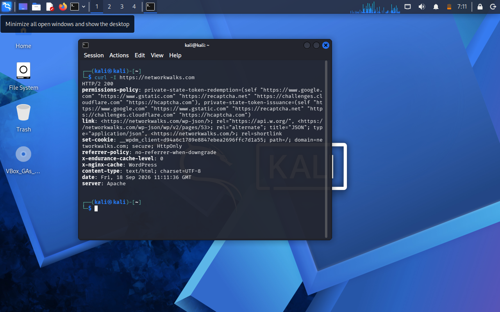
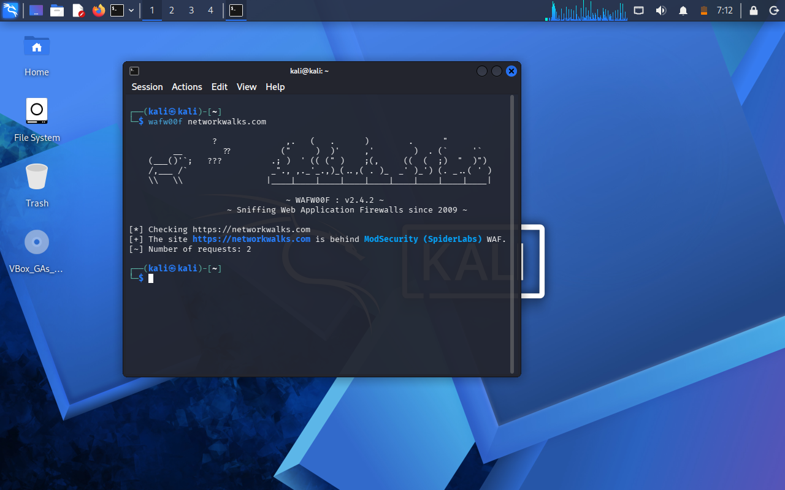
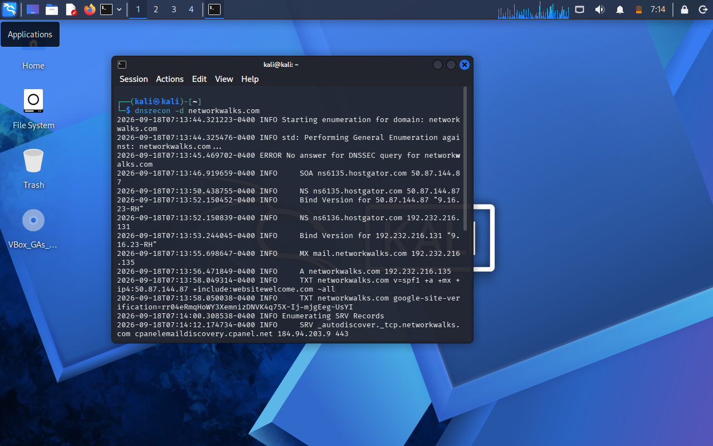
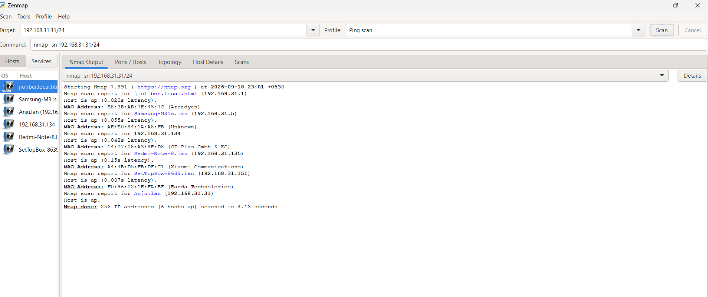
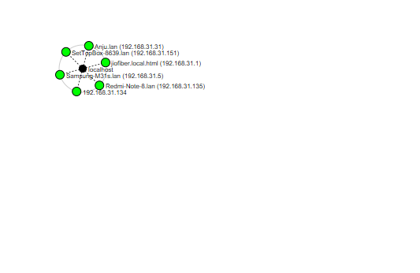

**# NETWORKWALKS-B083-WK2-PM1-Footprinting-PM5-Penetration Testing-Report**
-------------------
☑️**Penetration Testing Report — Footprinting & Network Scanning**
---

---

**📌 Project Information**

| 🧩 Component | ⚙️ Detail |
| :--- | :--- |
| Program | cybersecurity program at Networkwalks |
| Week | 02|
| ⚡ Module | W2-PM1 — Multiple Kali Tools|
|           | W2-PM5 — Zenmap Scanning |
| 🐉Phases Covered |Phase 1: 👣Reconnaissance & Footprinting  |                	
|           |Phase 2: Scanning & Network Discovery |
| 🌐 Target | Networkwalks |
|  Additional target | My own LAN network |
| 🔐Permission Secured | Yes |
| 🚪 Repository | Git hub |
------------------------------------------------
**1.Liability Desclaimer:**
-----------------

I have performed these activities only on systems and devices where I had secured written permission or on devices/systems that I own myself.

All materials are provided for educational and research purposes only. Do not use anything from this report to break the law.

The instructor, authors, and Networkwalks are not responsible for misuse of the information provided in this report. Every action taken using this knowledge is the user's own responsibility.

Unauthorized access to computer systems can result in criminal charges, financial penalties, loss of employment, and other legal consequences.

**2.Introduction:**
----------------------
This Report covers my Week 2 project where  the footprinting and scanning on a network of Networkwalks.com domain with written permission to perform the basic attacks in an isolated environment.Where:-
W2 -Module 1:-This module demonstrate footprinting phase by using Kali linux tools.

W2-Module 2:-Here It covers the scanning phase.

Together, they demonstrate how a security professional can move from gathering publicly available information to discovering live hosts on a network.

All commands were performed using Kali Linux for footprinting and a Windows PC with Zenmap installed for network scanning.

Each activity includes:

- Network reconnaissance
- Port scanning 
- Screenshot evidence collected
- Report maintaing
- Security tool experimentation with Zenmap

**3.⚙️Tools used:**
---------------------
| 🧩 Tools |  Aim |                                                                                                           
| :--- | :--- |
| 🖥️ Kali Linux & windows OS | OS used for recognaissance and scanning |
| 🧠 WHOIS |Shows Public available domain registeration details ,date,server name.  |
|  🌐 WHATWEB |  Fingerprint web technologies such as servers, CMS platforms, plugins, and IP information|
| 🧠 Nslookup | Domain name to ip address using DNS |
| ✴️Curl-I  | Inspect HTTP response headers from a website |
| 📡 Wafw00f | Inspect Firewall used in web application |
 | DNSRecon |Enumerate DNS records such as NS, MX, SPF, TXT, and SRV records|
| Zenmap (N-map GUI) |Scan the local subnet to identify live hosts, IP addresses, and MAC addresses |
| Windows CMD |  Information about local ip address and mac address |

**4.Activities Performed:**
------------------------------
**4.1 Footprinting & Reconnaissance**
------------------
I have performed footprinting on website Networkwalks.com domain using 6 Kali linux tools:-
- WHOIS
- WhatWeb
- Nslookup
- Curl-I
- Wafw00f
- DNSRecon
Each tools gave different details about the website.
---------------------------------
**WHOIS**
-----
Firstly of all,I used this tool to determine the Publicaly available details of domain like regesteration info.,server name,Date.

**WhatWeb**
------
Secondly I used this to fetch the Tech-service it used .And it gave me result like:-
- WordPress 7.0.4
- WP Download Manager 3.3.58
- Other information exposed by the website
  
  **Nslokup**
  ----------
  Nslookup change domain name into ip address ,The ip address i got is:-

  **Curl**
  -----------
   used Curl with the **-I **option to inspect the HTTP response headers. This provided additional information about the web application
   and exposed the WordPress REST API endpoint /wp-json/.

  **Wafw00f**
  -------
  It is graphical firewall detector to detect that which firewall is used to protect the website.
  It gave result about the firewall used in website --> ModSecurity (SpiderLabs).
  
  **DNSRecon**
  ------
  Finally, I used DNSRecon to enumerate DNS records. The results provided information related to name servers, mail servers, SPF/TXT records, service records, and DNS software information.
  
  ----------------------------------------------------------------------------------------------------------------------------------------------------------------------------
  **4.2 Network Scanning with Zenmap**
  ------
For the second activity, I used Zenmap to perform network discovery on my local network. The scan required me to identify my local IP address and subnet, discover live hosts, identified their IP and MAC addresses, and generate a network topology.

Step 1:-I first used windows cmd  and then perform this command to determine my local ip address.

**ipconfig/all**

Step 2:- I downloaded Zenmap-nmap in windows and then added ip address into the target and performed  ping scan.
The result i got is ip address,mac address .

Step 3:- Generate Network Topology
After completing the scan, I opened the Topology section in Zenmap, enabled the legend, and saved the network topology in PDF format as required by the practical task.

---------------------------------------------------------------------------------------------------------------------------

**5.⚠️Risk Analysis**
--------
Based on the information collected during the footprinting and network scanning activities, the following potential risks were identified
| 🧩 Risk Finding | Observation | Potential Impact | Risk Level |
|-----------------|-------------|------------------|------------|
| Web technology information exposed | WhatWeb identified WordPress and WP Download Manager | Attackers may use technology/version info to exploit software | Medium |
| Server IP address identified | Nslookup resolved the domain to `192.232.216.135` | Reveals network location of web service | Low |
| HTTP technical information exposed | Curl returned HTTP response headers and exposed `/wp-json/` | May assist enumeration and fingerprinting | Low |
| WAF technology identified | Wafw00f determined ModSecurity (SpiderLabs) | Reveals security architecture of web service | Low |
| DNS infrastructure information exposed | DNSRecon identified DNS, mail, and service-related records | DNS details can help build infrastructure profile | Medium |
| Multiple live hosts on local network | Zenmap scan revealed active devices | Unknown or unauthorized devices may be present on network | Medium |

**Risk level key**
🔴High
🟡Medium
🟢Low

Note:-The risk level above observations do not confirmed any vulnerability .
          The practical exercises primarily involved information gathering and host discovery. No exploitation or vulnerability validation was performed as part of these two modules.

Therefore, the presence of information such as a software version, IP address, or DNS record does not by itself mean that the system is vulnerable. Further authorized security testing would be required to confirm any actual vulnerability

------------------------------
**6.↪️ Security Recomendation**
-----
1. **Check what’s visible online**  
   Regularly see what info about your website, CMS, and plugins is exposed publicly.  

2. **Update software often**  
   Keep WordPress, plugins, and other tools updated with the latest security patches.  

3. **Review HTTP headers**  
   Remove or limit extra technical details in response headers.  

4. **Check DNS records**  
   Make sure only necessary DNS records are exposed.  

5. **Configure WAF properly**  
   Keep ModSecurity active and tuned to block attacks.  

6. **Scan your internal network**  
   Run scans to see which devices are active.  

7. **Investigate unknown devices**  
   If a new or strange device shows up, check it immediately.  

8. **Document your network**  
   Maintain updated records of devices and network layout.  

9. **Do authorized testing only**  
   Run scans and reconnaissance only with proper permission.

    # 📚 Internship Report – Week 2  
**Cybersecurity & Ethical Hacking Internship**

During the  week-2 of my project, I focused on practical exercises related to **footprinting, reconnaissance, and network scanning**. These activities gave me hands-on exposure and helped me understand the importance of information gathering in cybersecurity.

### 🔎 Footprinting Activity
I worked with six Kali Linux tools to collect information about the target domain:
- **WHOIS** → Domain registration details  
- **WhatWeb** → Identify web technologies  
- **Nslookup** → Resolve domain names  
- **Curl** → Examine HTTP headers  
- **Wafw00f** → Detect Web Application Firewall  
- **DNSRecon** → Gather DNS-related records  

### 🌐 Network Scanning Activity
I used **Zenmap** to scan my local network:
- Identified active hosts, IP and MAC addresses  
- Created a simple network topology to understand the structure  

### 📚 Key Learnings
- Information gathering is the first step before exploitation  
- Documentation should clearly describe activities, findings, risks, and recommendations  
- Reconnaissance and scanning must always be performed **with authorization**  

All activities were conducted within the assigned educational cybersecurity lab environment
-----------------------------------
**📷Evidence collected**
--
Who is 
--

**whatweb**
--

**nslookup**
--

Curl-I
--

**Wafw00f**
--

**DNSRecon**
--

**Zenmap scan**
--

topology
--

--
**🐛Troublshooting**
--
During performing kali linux tools i got network issue and could not fetch details about the domain service.i tried severaal time then with the help of instructor video i got to know that many of students had same issue and i got to know about where i made mistake Then i fixed  issue by network configuration Nat to Nat Network .Finally ,I was able to perform activities for footprinting.
In the scanning phase i was confused to add which ip address then i grasp knowledge of ip address and subnet it became easy to detect the information about Lan local network.

**💡What I Learn**
--
- Differentiate b/w Nat and Nat network
- Understood how vital documentation is for cybersecurity professionals - recording problems, solutions, configurations, and step-by-step procedures
-Importance of Report writing .
-Got to know about Autorisation permission letter which will help me in future.
-Learned proper storage management techniques
-Learned different tools of kali linux.

**🔐 Security and Ethical Use**
--
This laboratory is strictly used for educational purposes only. All activities conducted within this lab must comply with applicable laws and regulations. Unauthorized access to computer systems is illegal and unethical. All penetration testing and security assessments must be conducted only on systems for which explicit written permission has been obtained from the authorized owner.

------
**:👤 Author**
--
Anju

Cybersecurity Intern BO83

LinkedIn: www.linkedin.com/in/anju-84b8ba394

                           

